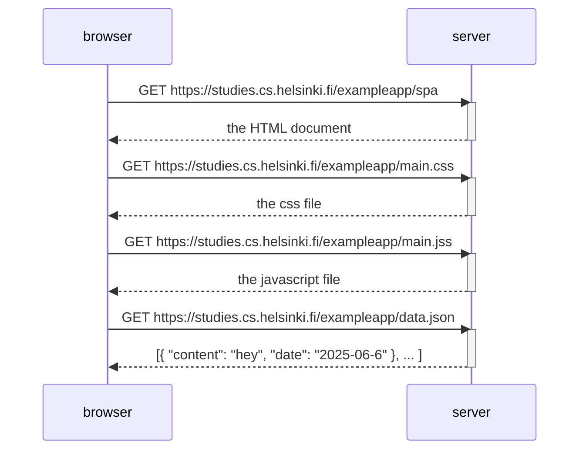

# Exercise 5 SPA Sequence Diagram

```mermaid
sequenceDiagram

participant browser
participant server

browser->>server: GET https://studies.cs.helsinki.fi/exampleapp/spa
activate server
server-->>browser: the HTML document
deactivate server

browser->>server: GET https://studies.cs.helsinki.fi/exampleapp/main.css
activate server
server-->>browser: the css file
deactivate server

browser->>server: GET https://studies.cs.helsinki.fi/exampleapp/main.jss
activate server
server-->>browser: the javascript file
deactivate server

browser->>server: GET https://studies.cs.helsinki.fi/exampleapp/data.json
activate server
server-->>browser: [{ "content": "hey", "date": "2025-06-6" }, ... ]
deactivate server
```
