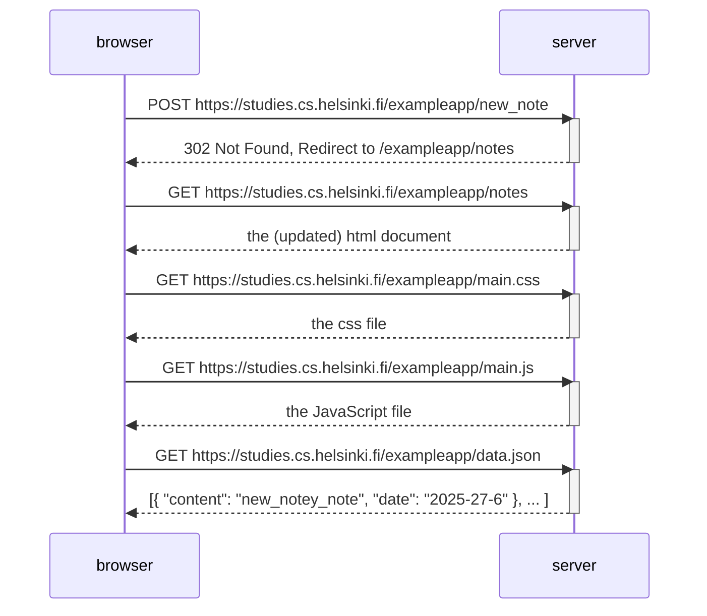

# Exercise 6 SPA Form Submit Sequence Diagram

```mermaid
sequenceDiagram

participant browser
participant server

browser->>server: POST https://studies.cs.helsinki.fi/exampleapp/new_note
activate server
server-->>browser: 302 Not Found, Redirect to /exampleapp/notes
deactivate server

browser->>server: GET https://studies.cs.helsinki.fi/exampleapp/notes
activate server
server-->>browser: the (updated) html document
deactivate server

browser->>server: GET https://studies.cs.helsinki.fi/exampleapp/main.css
activate server
server-->>browser: the css file
deactivate server

browser->>server: GET https://studies.cs.helsinki.fi/exampleapp/main.js
activate server
server-->>browser: the JavaScript file
deactivate server

browser->>server: GET https://studies.cs.helsinki.fi/exampleapp/data.json
activate server
server-->>browser: [{ "content": "new_notey_note", "date": "2025-27-6" }, ... ]
deactivate server
```
